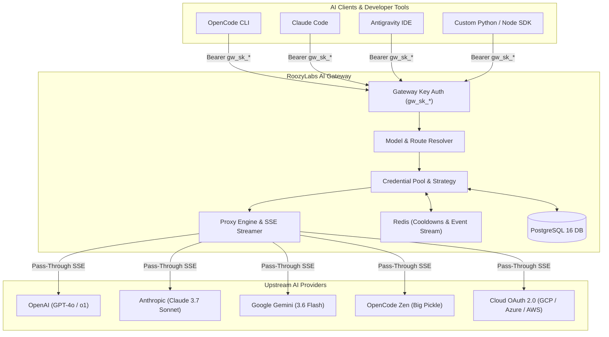

# Business Analyst Domain Knowledge Review & Analytics Enhancement Specifications

## Revision History

| Version | Date & Time | Description of Changes | Author |
| :--- | :--- | :--- | :--- |
| 1.0 | 19 August 2026, 21:35 WIB | Initial Onboarding & Domain Knowledge Review and Analytics Recommendations | Business Analyst (Eleana) |

---

## 1. Executive Summary & Domain Onboarding Confirmation

As the dedicated Business Analyst for the **AI Gateway** platform (RoozyLabs / RoozyCapital), this document confirms complete domain understanding of the platform's multi-provider routing architecture, credential rotation engine, resilience policies, client integrations, and analytics telemetry.

### 1.1 Core Value Proposition
AI Gateway acts as an enterprise-grade, centralized LLM API reverse proxy and model router that simplifies multi-provider API management:
1. **Unified OpenAI-Compatible API**: Exposes standard `/v1/chat/completions` and `/v1/models` endpoints to client tools (OpenCode CLI, Claude Code, Antigravity, custom SDKs).
2. **Automated Credential Rotation**: Distributes incoming traffic across healthy provider API keys using configurable allocation strategies (Round Robin, Least Recently Used, Fallback Cascade).
3. **Resilience & Cooldown Management**: Transparently intercepts upstream `HTTP 429` (Rate Limited) and `HTTP 5xx` errors, applies Redis-backed cooldown timers (up to 24h for quota exhaustion), and automatically fails over to secondary keys without client disruption.
4. **Credential Isolation & Zero-Leak Security**: Completely obscures upstream provider secrets (`sk-ant-*`, `sk-proj-*`, `AIzaSy*`, OAuth tokens) behind hashed Gateway API keys (`gw_sk_*`) and AES-256-GCM encrypted persistence.



---

## 2. Deep-Dive Architecture & Integration Review

### 2.1 Upstream Provider Adapters & Multi-Auth Architecture
The gateway implements modular `ProviderAdapter` interfaces in Go (`/api/internal/proxy/`):
- **OpenAI Adapter (`openai.go`)**: Direct pass-through of chat completion JSON payloads and SSE delta chunks with `Authorization: Bearer <key>`.
- **Anthropic Adapter (`anthropic.go`)**: Normalizes Anthropic Messages API format to OpenAI-compatible request/response schemas.
- **Google Gemini Adapter (`google.go`)**: Routes to official Google OpenAI-compatible endpoints (`/v1beta/openai/chat/completions`) using upstream model mapping (e.g. `gemini-3.6-flash`).
- **OpenCode Zen Adapter (`opencode.go`)**: Injects mandatory `User-Agent: opencode-cli/1.0` header required by OpenCode Zen endpoints.
- **Multi-Auth Cloud Roadmap (V2)**: Auto-refreshes Google GCP OAuth (`gcp_user_oauth`), Service Account JWTs (`gcp_service_account`), Azure Entra ID tokens (`azure_oauth`), and AWS SigV4 STS credentials (`aws_iam`).

### 2.2 Client Integration Standards
Clients integrate by pointing their base URL to AI Gateway:
- **OpenCode CLI (`opencode.jsonc`)**:
  ```jsonc
  {
    "$schema": "https://opencode.ai/config.json",
    "provider": {
      "roozylabs-ai-gateway": {
        "options": {
          "baseURL": "http://<GATEWAY_HOST>:8080/v1",
          "apiKey": "gw_sk_xxxxxxxxxxxxxxxx"
        },
        "models": {
          "gemini-3.6-flash": { "name": "Gemini 3.6 Flash" },
          "big-pickle": { "name": "Big Pickle" },
          "claude-3-7-sonnet": { "name": "Claude 3.7 Sonnet" }
        }
      }
    }
  }
  ```
- **OpenAI Python SDK**:
  ```python
  from openai import OpenAI
  client = OpenAI(
      base_url="http://<GATEWAY_HOST>:8080/v1",
      api_key="gw_sk_xxxxxxxxxxxxxxxx"
  )
  response = client.chat.completions.create(
      model="gemini-3.6-flash",
      messages=[{"role": "user", "content": "Hello AI Gateway!"}],
      stream=True
  )
  ```

---

## 3. Business Analytics & Reporting Gap Analysis

Evaluating the current schema (`request_logs`), dashboard KPI metrics, and PRD objectives reveals key opportunities to elevate business observability and cost intelligence:

| Dimension | Current State | Target SLA / Business Need | Gap / Enhancement Opportunity |
| :--- | :--- | :--- | :--- |
| **Token Cost Tracking** | Raw `input_tokens`, `output_tokens`, `total_tokens` stored in `request_logs`. | Accurate financial tracking ($ spend per model, key, and provider). | No model pricing catalog table or automated cost calculation in logs/dashboard. |
| **Latency SLA Benchmarking** | Total `latency_ms` recorded per request. | Time to First Token (TTFT) SLA < 1,500 ms for streaming responses. | Schema does not differentiate `ttft_ms` (Time to First Token) from full response duration `latency_ms`. |
| **Prompt Caching Savings** | Cached tokens counted as generic prompt tokens. | Quantifying ROI from Anthropic/OpenAI/Gemini prompt caching (up to 90% discount). | Schema lacks `cached_tokens` / `cache_read_tokens` column to measure cache hit ratios and monetary savings. |
| **Quota & Rate Limits** | Basic `rate_limit` (RPM) on `gateway_api_keys`. | Multi-tier tenant quotas (RPM, TPM, Daily Token/Budget Cap, Soft Alerts). | Keys lack TPM limits, daily token limits, and spend cap enforcement. |
| **Failover Observability** | Basic `retry_count` stored in `request_logs`. | Quantitative failover recovery rate (%) and latency overhead tracking. | No dashboard metric aggregating failover success rate or retry latency degradation. |

---

## 4. Proposed Feature Specifications & Upcoming Sprint Roadmap

### 4.1 Feature Spec 1: Real-Time Cost Tracking & Model Pricing Catalog (V1.1)

#### 4.1.1 Business Context & User Story
- **Problem**: Engineering teams and finance need visibility into exact LLM spend across models and client keys to prevent unexpected cost surges.
- **User Story**:
  > **As a** Finance Manager or Lead Engineer,  
  > **I want to** see real-time estimated dollar spend per request, model, provider, and gateway key,  
  > **So that** I can accurately attribute AI costs to internal projects and optimize model routing for cost efficiency.

#### 4.1.2 Functional Requirements
1. **Model Pricing Registry**: Create a table `model_pricings` storing `prompt_price_per_1m`, `completion_price_per_1m`, and `cached_prompt_price_per_1m` in USD.
2. **Cost Calculation Engine**: Compute request cost at log-write time:
   $$\text{Cost} = \left(\frac{\text{Input Tokens} \times P_{\text{in}}}{1,000,000}\right) + \left(\frac{\text{Output Tokens} \times P_{\text{out}}}{1,000,000}\right)$$
3. **Dashboard Spend KPI**: Display Total Spend ($), Cost per 1K Tokens, and Daily Spend Trendline on the dashboard overview.

#### 4.1.3 Database Migration Spec
```sql
-- Migration: Add cost_usd and pricing table
CREATE TABLE model_pricings (
    id UUID PRIMARY KEY DEFAULT gen_random_uuid(),
    model_slug VARCHAR(255) UNIQUE NOT NULL,
    provider_type VARCHAR(50) NOT NULL,
    prompt_price_per_1m NUMERIC(10, 6) NOT NULL,
    completion_price_per_1m NUMERIC(10, 6) NOT NULL,
    cached_prompt_price_per_1m NUMERIC(10, 6) DEFAULT 0,
    effective_date TIMESTAMPTZ DEFAULT NOW()
);

ALTER TABLE request_logs ADD COLUMN cost_usd NUMERIC(10, 6) DEFAULT 0;
```

---

### 4.2 Feature Spec 2: Time to First Token (TTFT) & SLA Telemetry (V1.1)

#### 4.2.1 Business Context & User Story
- **Problem**: Full latency combines model processing time with total generation length, obscuring actual interactive streaming responsiveness.
- **User Story**:
  > **As an** AI Gateway Administrator,  
  > **I want to** measure Time to First Token (TTFT) separately from total stream duration,  
  > **So that** I can enforce the TTFT < 1,500 ms SLA and detect sluggish upstream providers immediately.

#### 4.2.2 Functional Requirements
1. **Timestamp First Chunk**: `ProxyStream` records `ttft_ms = time.Since(startTime).Milliseconds()` when the first non-empty SSE data chunk is received from upstream.
2. **Request Log Schema**: Store `ttft_ms` alongside `latency_ms`.
3. **SLA Dashboard Breakdown**: Display P50 / P95 / P99 TTFT benchmark graphs by provider on the Dashboard.

```sql
-- Migration: Add ttft_ms to request_logs
ALTER TABLE request_logs ADD COLUMN ttft_ms INTEGER DEFAULT 0;
CREATE INDEX idx_request_logs_ttft ON request_logs(ttft_ms);
```

---

### 4.3 Feature Spec 3: Client Gateway Key Quota & Tiering System (V1.2)

#### 4.3.1 Business Context & User Story
- **Problem**: Client keys currently only enforce simple Requests Per Minute (RPM) limits, lacking token rate limits (TPM) or daily budget guards.
- **User Story**:
  > **As a** Platform Administrator,  
  > **I want to** assign usage tiers (Free, Developer, Enterprise) to Gateway API Keys with RPM, TPM, and daily token quotas,  
  > **So that** a rogue script or runaway loop cannot exhaust company API quotas or incur massive bills.

#### 4.3.2 Quota Tier Matrix
| Tier Name | Requests / Min (RPM) | Tokens / Min (TPM) | Daily Token Cap | Max Concurrency | Failover Priority |
| :--- | :--- | :--- | :--- | :--- | :--- |
| **Tier 1 (Internal Dev)** | 30 RPM | 60,000 TPM | 500,000 Tokens/day | 3 Concurrent | Standard |
| **Tier 2 (Core Team)** | 120 RPM | 300,000 TPM | 5,000,000 Tokens/day | 10 Concurrent | High |
| **Tier 3 (Production Apps)** | 600 RPM | 2,000,000 TPM | Unlimited / Budget Cap | 50 Concurrent | Critical |

---

### 4.4 Feature Spec 4: Resilience & Failover Recovery Analytics

#### 4.4.1 Business Context & Acceptance Criteria
- **SLA Objective**: Maintain > 99.5% service availability with failover latency overhead < 500 ms during provider 429/503 incidents.
- **Observability Metric**:
  $$\text{Failover Recovery Rate} = \frac{\text{Successful Requests with } \text{retry\_count} > 0}{\text{Total Requests Encountering Upstream 429/5xx}} \times 100\%$$
- **Acceptance Criteria**:
  - [ ] Dashboard displays live "Failover Recovery Rate" percentage tag.
  - [ ] Credential cooldown events are emitted to Redis Pub/Sub and rendered in real-time on `CredentialsPage` and `DashboardPage`.
  - [ ] Requests that recover through secondary keys log HTTP 200 with `retry_count >= 1` and failover reason in `request_logs`.

---

## 5. Summary of Recommended Next Actions

1. **Handoff to Engineering**: Deliver SQL migration specs for `cost_usd`, `ttft_ms`, and `model_pricings` to Backend Engineers.
2. **Handoff to Frontend / QA**: Deliver UI widget specifications for Cost Breakdown, TTFT Distribution, and Quota Tier Badges.
3. **Executive Reporting**: Establish weekly automated SLA and Token Consumption reports for executive leadership.
