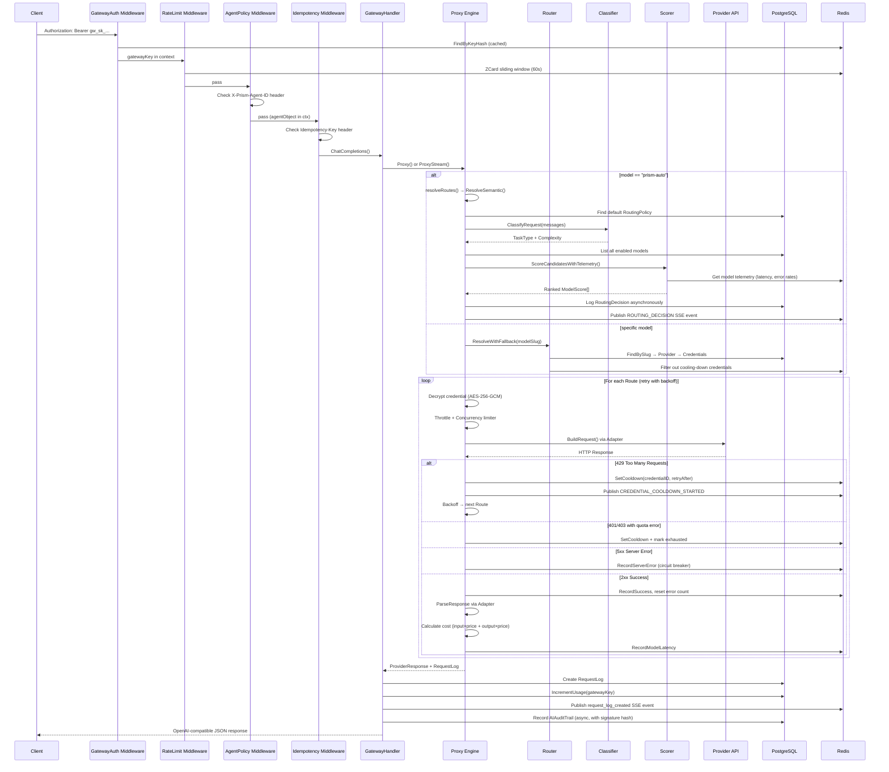
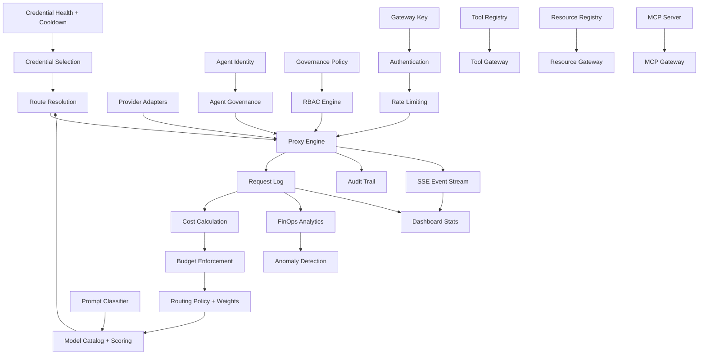

# Prism — Deep Repository Understanding & Architecture Map

> **Scope**: This document describes *what Prism currently is*, based entirely on implementation evidence. No recommendations, redesigns, or roadmap proposals.

---

## 1. Executive Understanding — What Prism Is Today

Prism is an **AI API Gateway and Infrastructure Control Plane** built as a monorepo containing three deployable applications:

| App | Tech Stack | Purpose |
|-----|-----------|---------|
| [`apps/api`](file:///c:/me/projects/ai-gateway/apps/api) | Go (Gin), PostgreSQL, Redis | Proxy engine, API server, background workers |
| [`apps/app`](file:///c:/me/projects/ai-gateway/apps/app) | Next.js 16, React 19, Tailwind, shadcn/ui | Admin dashboard / console |
| [`apps/web`](file:///c:/me/projects/ai-gateway/apps/web) | Astro | Public landing page |

**Primary User Today**: A single platform administrator who manages AI providers, credentials, models, budgets, agents, tools, resources, and MCP servers. The dashboard is single-user/single-tenant in practice, though multi-tenant schema exists.

**Problem Prism Currently Solves**: Prism lets an operator:
1. **Centralize** multiple AI provider credentials (OpenAI, Anthropic, Google, OpenCode, Groq, DeepSeek) behind a single OpenAI-compatible API endpoint
2. **Abstract** model selection via a "smart router" (`prism-auto`) that classifies prompts and scores models
3. **Ensure reliability** via automatic credential rotation, cooldown, rate-limit handling, failover, and retry with exponential backoff
4. **Observe** all AI usage: request logs, token counts, latency, cost, anomaly detection, audit trails
5. **Govern** agent access to models, tools, and resources via governance policies

---

## 2. Product Domain Map

### 2.1 Auth & Identity

| Aspect | Detail |
|--------|--------|
| **Purpose** | User authentication for dashboard and gateway key auth for API consumption |
| **Entities** | `User`, `Session`, `Account` |
| **DB Tables** | `users`, `sessions`, `accounts` |
| **APIs** | `POST /auth/login`, `POST /auth/logout`, `GET /auth/me`, Google OAuth |
| **Service** | [`service.AuthService`](file:///c:/me/projects/ai-gateway/apps/api/internal/service) |
| **UI** | [`/login`](file:///c:/me/projects/ai-gateway/apps/app/app/login) page |
| **Auth Mechanism** | Session-token based (stored in cookie `auth_token`), not JWT. Gateway uses `gw_sk_*` hashed keys. |

### 2.2 Providers

| Aspect | Detail |
|--------|--------|
| **Purpose** | Registry of AI provider backends (OpenAI, Anthropic, Google, OpenCode, etc.) |
| **Entities** | `Provider` |
| **DB Tables** | `providers` |
| **APIs** | Full CRUD at `/providers` |
| **Fields** | `id`, `user_id`, `name`, `slug`, `base_url`, `type`, `enabled`, `routing_strategy`, `org_id`, `workspace_id` |
| **UI** | [`/providers`](file:///c:/me/projects/ai-gateway/apps/app/app/providers) |
| **Adapters** | `openai.go`, `anthropic.go`, `google.go`, `opencode.go` (all implement `ProviderAdapter` interface) |

### 2.3 Credentials

| Aspect | Detail |
|--------|--------|
| **Purpose** | Encrypted API key storage with health tracking, cooldown management, and quota tracking |
| **Entities** | `Credential`, `CredentialQuota` |
| **DB Tables** | `credentials` |
| **APIs** | CRUD nested under provider (`/providers/:id/credentials`) + top-level (`/credentials`) |
| **Key Fields** | `encrypted_key`, `key_prefix`, `masked_key`, `auth_type`, `priority`, `status`, `health_score`, `request_count`, `error_count` |
| **Auth Types** | `api_key`, `gcp_user_oauth`, `gcp_service_account`, `azure_oauth`, `aws_iam`, `github_oauth` |
| **Statuses** | `active`, `rate_limited`, `cooldown`, `exhausted`, `invalid`, `disabled`, `healthy`, `degraded` |
| **UI** | [`/credentials`](file:///c:/me/projects/ai-gateway/apps/app/app/credentials) |

### 2.4 Models

| Aspect | Detail |
|--------|--------|
| **Purpose** | Catalog of available AI models with capability scores and pricing |
| **Entities** | `Model`, `ModelPricing`, `ModelLatencyHourly` |
| **DB Tables** | `models`, `model_pricings`, `model_latency_hourly` |
| **APIs** | CRUD at `/providers/:id/models` + top-level `/models` |
| **Key Fields** | `slug`, `display_name`, `context_window`, `coding_score`, `reasoning_score`, `writing_score`, `speed_score`, `quality_score`, `input_price_per_1m`, `output_price_per_1m`, `supports_tools`, `supports_vision` |
| **UI** | [`/models`](file:///c:/me/projects/ai-gateway/apps/app/app/models) |

### 2.5 Gateway Keys

| Aspect | Detail |
|--------|--------|
| **Purpose** | API keys (`gw_sk_*`) that authenticate external clients/agents against the proxy |
| **Entities** | `GatewayAPIKey` |
| **DB Tables** | `gateway_api_keys` |
| **APIs** | CRUD at `/gateway-keys` |
| **Key Fields** | `key_hash`, `key_prefix`, `rate_limit`, `allowed_models`, `expires_at`, `request_count`, `org_id`, `workspace_id`, `project_id` |
| **Cache** | `GatewayKeyCache` wraps `GatewayKeyRepository` for hot-path lookup |
| **UI** | [`/gateway-keys`](file:///c:/me/projects/ai-gateway/apps/app/app/gateway-keys) |

### 2.6 Routing

| Aspect | Detail |
|--------|--------|
| **Purpose** | Smart model selection via prompt classification, multi-criteria scoring, and policy evaluation |
| **Entities** | `RoutingPolicy`, `RoutingRule`, `RoutingDecision` |
| **DB Tables** | `routing_policies`, `routing_rules`, `routing_decisions` |
| **APIs** | CRUD for policies at `/policies`, `/routing-policies`; Rules at `/routing-rules`; Decisions at `/routing/decisions`; Simulation at `/routing/simulate` |
| **Smart Router** | `prism-auto` model triggers `ResolveSemantic()` → Classifier → Scorer → Route selection |
| **Strategies** | `round_robin`, `lru`, `fallback` (per-provider) |
| **UI** | [`/policies`](file:///c:/me/projects/ai-gateway/apps/app/app/policies), [`/playground`](file:///c:/me/projects/ai-gateway/apps/app/app/playground) |

### 2.7 Budgets & Quotas

| Aspect | Detail |
|--------|--------|
| **Purpose** | Spend limits with warning/critical thresholds; multi-tenant quota enforcement |
| **Entities** | `Budget`, `BudgetStatus`, `BudgetAlert`, `TenantQuota` |
| **DB Tables** | `budgets`, `budget_alerts`, `tenant_quotas` |
| **APIs** | CRUD at `/budgets`; Status at `/budgets/status`; Quotas at `/quotas` |
| **Hard Limit** | When `hard_limit=true`, budget manager can influence routing decisions (model downgrade) |
| **Workers** | `BudgetAlertScanner` runs every 2 minutes |
| **UI** | [`/budgets`](file:///c:/me/projects/ai-gateway/apps/app/app/budgets) |

### 2.8 Tools & Tool Gateway

| Aspect | Detail |
|--------|--------|
| **Purpose** | Custom tool registry with HTTP backends; Tools can be invoked via gateway by AI agents |
| **Entities** | `Tool`, `ToolBackend`, `ToolInvocation` |
| **DB Tables** | `tools`, `tool_backends`, `tool_invocations` |
| **APIs** | Admin CRUD at `/tools`; Execution at `/v1/tools/:toolName/execute` |
| **UI** | [`/tools`](file:///c:/me/projects/ai-gateway/apps/app/app/tools) |

### 2.9 Resources & Resource Gateway

| Aspect | Detail |
|--------|--------|
| **Purpose** | Data resources (HTTP APIs, SQL databases) that agents can query |
| **Entities** | `Resource`, `ResourceBackend` |
| **DB Tables** | `resources`, `resource_backends` |
| **APIs** | Admin CRUD at `/resources`; Execution at `/v1/resources/:resourceName/query` |
| **Backend Types** | HTTP endpoint, SQL database (with `connection_string_encrypted`, `sql_query`, `param_names`) |
| **UI** | [`/resources`](file:///c:/me/projects/ai-gateway/apps/app/app/resources) |

### 2.10 MCP Gateway

| Aspect | Detail |
|--------|--------|
| **Purpose** | Model Context Protocol server management; sync and execute remote MCP tools |
| **Entities** | `MCPServer`, `MCPTool`, `MCPRegistryServer` |
| **DB Tables** | `mcp_servers`, `mcp_tools`, `mcp_registry` |
| **APIs** | CRUD at `/mcp/servers`; Sync at `/mcp/servers/:id/sync`; Test at `/mcp/servers/:id/test`; Registry at `/mcp/registry` |
| **UI** | [`/mcp`](file:///c:/me/projects/ai-gateway/apps/app/app/mcp) |

### 2.11 Agents

| Aspect | Detail |
|--------|--------|
| **Purpose** | Named AI agent identities with model/tool/resource access controls and budget caps |
| **Entities** | `Agent`, `AgentTemplate` |
| **DB Tables** | `agents`, `agent_templates` |
| **APIs** | CRUD at `/agents`; Templates at `/agent-templates`; Instantiate at `/agent-templates/:id/instantiate` |
| **Key Fields** | `allowed_models`, `allowed_tools`, `allowed_resources`, `max_budget_cents`, `system_prompt_override` |
| **Governance** | `AgentGovernanceEngine` validates model/tool access before proxy execution |
| **Paperclip** | `PaperclipAdapter` enables external agent frameworks to self-register |
| **UI** | [`/agents`](file:///c:/me/projects/ai-gateway/apps/app/app/agents) |

### 2.12 Governance & RBAC

| Aspect | Detail |
|--------|--------|
| **Purpose** | Pattern-based allow/deny policies for role×agent×model×tool×resource combinations |
| **Entities** | `GovernancePolicy`, `RBACEvaluationRequest/Result`, `Permission`, `Role`, `MemberInvite` |
| **DB Tables** | `governance_policies`, `permissions`, `roles`, `role_permissions`, `member_invites` |
| **APIs** | CRUD at `/governance/policies`; Evaluate at `/governance/evaluate` |
| **Engine** | [`RBACEngine`](file:///c:/me/projects/ai-gateway/apps/api/internal/proxy/rbac_engine.go) — glob pattern matching, deny-takes-precedence, default-allow |
| **System Roles** | `owner`, `developer`, `agent_manager`, `finops_manager`, `auditor`, `viewer` |
| **UI** | [`/governance`](file:///c:/me/projects/ai-gateway/apps/app/app/governance) |

### 2.13 Audit Trail

| Aspect | Detail |
|--------|--------|
| **Purpose** | Tamper-evident audit trail with cryptographic SHA-256 signatures for every AI request |
| **Entities** | `AIAuditTrail`, `AuditLogItem`, `AuditVerificationResult` |
| **DB Tables** | `ai_audit_trails`, `audit_logs` |
| **APIs** | List at `/audit-trail`; Export at `/audit-trail/export`; Verify at `/audit-trail/:id/verify` |
| **Signature** | `SHA256(requestID:userID:promptHash:responseHash:modelSlug)` |
| **UI** | [`/audit-trail`](file:///c:/me/projects/ai-gateway/apps/app/app/audit-trail) |

### 2.14 Multi-Tenancy

| Aspect | Detail |
|--------|--------|
| **Purpose** | Organization → Workspace → Project hierarchy |
| **Entities** | `Organization`, `Workspace`, `Project`, `OrganizationMember`, `TenantContext` |
| **DB Tables** | `organizations`, `workspaces`, `projects`, `organization_members` |
| **Middleware** | [`TenantMiddleware`](file:///c:/me/projects/ai-gateway/apps/api/internal/middleware/tenant.go) extracts `X-Prism-Org-ID`, `X-Prism-Workspace-ID`, `X-Prism-Project-ID` headers |
| **Reality** | Schema exists with foreign keys on major tables. Default tenant is seeded (`org_default`/`ws_default`/`proj_default`). **No runtime tenant filtering is applied in queries.** All repositories query by `user_id`, not by `org_id`. |

### 2.15 Billing

| Aspect | Detail |
|--------|--------|
| **Purpose** | Subscription plans, invoices, daily usage aggregation |
| **Entities** | `BillingPlanSummary`, `SubscriptionStatusResponse`, `BillingInvoice`, `DailyUsageAggregate` |
| **DB Tables** | `subscription_plans`, `plan_features`, `organization_subscriptions`, `billing_invoices`, `daily_usage_aggregates` |
| **APIs** | `/billing/plans`, `/billing/subscription`, `/billing/invoices`, `/billing/usage` |
| **Reality** | Tables exist. APIs return seeded/static data. No payment processor integration. |

### 2.16 FinOps & Analytics

| Aspect | Detail |
|--------|--------|
| **Purpose** | Cost velocity tracking, spend forecasting, anomaly detection, cost optimization recommendations |
| **Entities** | `CostAnomaly`, `FinOpsSummary`, `CostRecommendation` |
| **DB Tables** | `cost_anomalies` |
| **APIs** | `/analytics/finops`, `/analytics/finops/anomalies`, `/analytics/finops/budget-alerts`, `/analytics/logs` |
| **Workers** | `AnomalyDetector` (every 15 min, z-score based), `BudgetAlertScanner` (every 2 min) |

### 2.17 Observability & Request Logs

| Aspect | Detail |
|--------|--------|
| **Purpose** | Per-request logging of model, provider, tokens, latency, cost, TTFT, client app, retry chain |
| **Entities** | `RequestLog`, `RequestPayload` |
| **DB Tables** | `request_logs`, `request_payloads` |
| **APIs** | `/logs`, `/dashboard/stats`, `/dashboard/usage`, `/dashboard/health` |
| **Key Metrics** | `input_tokens`, `output_tokens`, `cost_usd`, `latency_ms`, `ttft_ms`, `retry_count`, `response_hash`, `attempts` (JSON) |
| **SSE** | Real-time event streaming via `/sse` (Redis pub/sub) |
| **UI** | [`/logs`](file:///c:/me/projects/ai-gateway/apps/app/app/logs), Dashboard at [`/`](file:///c:/me/projects/ai-gateway/apps/app/app/page.tsx) |

---

## 3. Core Entity Relationships

```
Organization (schema exists, not enforced at runtime)
├── Workspace
│   └── Project
├── OrganizationMember ── User ── Role
│
User (user_id is the actual tenant boundary today)
├── Provider
│   ├── Credential (encrypted_key, health_score, cooldown)
│   └── Model (capability scores, pricing)
├── GatewayAPIKey (gw_sk_*, rate_limit, allowed_models)
├── Agent (allowed_models, allowed_tools, allowed_resources, max_budget)
├── Tool → ToolBackend (HTTP endpoint)
├── Resource → ResourceBackend (HTTP / SQL)
├── MCPServer → MCPTool
├── RoutingPolicy (weights: task_match, quality, cost, speed)
├── RoutingRule (model_pattern → provider)
├── Budget (monthly_limit, daily_limit, hard_limit)
├── GovernancePolicy (role × agent × model × tool × resource patterns)
└── Settings (key-value config)

RequestLog ← GatewayAPIKey, Provider, Credential, Model
AIAuditTrail ← RequestLog (signature chain)
RoutingDecision ← RequestLog (prompt classification, scores)
RequestPayload ← RequestLog (full conversation messages)
ToolInvocation ← RequestLog (tool calls extracted from response)
CostAnomaly ← RequestLog aggregation (z-score worker)
BudgetAlert ← Budget + RequestLog spend aggregation
```

### Relationship Implementation Status

| Relationship | Status |
|-------------|--------|
| Provider → Credential → Model | **Fully Implemented** — Core routing chain |
| GatewayKey → User | **Fully Implemented** — Auth + billing boundary |
| Agent → AllowedModels/Tools/Resources | **Implemented** — Governance enforced at proxy time |
| RoutingPolicy → Model scoring | **Implemented** — Multi-criteria scorer with DB policies |
| Budget → Routing decision | **Implemented** — Budget status triggers model downgrade |
| Organization → Workspace → Project | **Schema Only** — Foreign keys exist, runtime queries don't filter by org |
| Organization → OrganizationMember → Role | **Partially Implemented** — Tables + seed data exist, limited runtime usage |
| Billing → SubscriptionPlan → Invoice | **Schema Only** — Seeded plans, no payment integration |
| TenantQuota → Enforcement | **Schema Only** — Repository exists, not integrated into proxy hot path |

---

## 4. Request Lifecycle

Tracing the complete lifecycle of a `POST /v1/chat/completions` request:



### Stage Details

| Stage | Location | Entity | Produces | Consumed By |
|-------|----------|--------|----------|-------------|
| **Authentication** | [`middleware/gateway_auth.go`](file:///c:/me/projects/ai-gateway/apps/api/internal/middleware/gateway_auth.go) | `GatewayAPIKey` | `gatewayKey` in ctx | Rate limiter, Engine |
| **Rate Limiting** | [`middleware/ratelimit.go`](file:///c:/me/projects/ai-gateway/apps/api/internal/middleware/ratelimit.go) | Redis sorted set | 429 or pass | Gateway handler |
| **Agent Resolution** | [`middleware/agent_policy.go`](file:///c:/me/projects/ai-gateway/apps/api/internal/middleware/agent_policy.go) | `Agent` | `agentID`, `agentName` in ctx | Governance engine |
| **Idempotency** | [`proxy/idempotency.go`](file:///c:/me/projects/ai-gateway/apps/api/internal/proxy/idempotency.go) | Redis hash | Cached response or pass | Engine |
| **Prompt Classification** | [`proxy/classifier.go`](file:///c:/me/projects/ai-gateway/apps/api/internal/proxy/classifier.go) | `RequestCharacteristics` | TaskType, Complexity, ContextTokens | Scorer |
| **Model Scoring** | [`proxy/scorer.go`](file:///c:/me/projects/ai-gateway/apps/api/internal/proxy/scorer.go) | `ModelScore[]` | Ranked candidates | Router |
| **Route Resolution** | [`proxy/router.go`](file:///c:/me/projects/ai-gateway/apps/api/internal/proxy/router.go) | `Route[]` | Model + Provider + Credential + Adapter | Engine retry loop |
| **Provider Call** | [`proxy/engine.go`](file:///c:/me/projects/ai-gateway/apps/api/internal/proxy/engine.go) L276-598 | `ProviderResponse` | Tokens, cost, latency | Request log |
| **Payload Persistence** | [`proxy/engine.go`](file:///c:/me/projects/ai-gateway/apps/api/internal/proxy/engine.go) L137-162 | `RequestPayload` | Full conversation messages | Retention worker |
| **Cost Calculation** | Engine L542-544 | Per-request | `costUSD` | Budget, FinOps, Logs |
| **Audit Recording** | [`proxy/audit_recorder.go`](file:///c:/me/projects/ai-gateway/apps/api/internal/proxy/audit_recorder.go) | `AIAuditTrail` | Signature hash | Compliance |
| **Event Publishing** | [`redis/events.go`](file:///c:/me/projects/ai-gateway/apps/api/internal/redis/events.go) | Redis pub/sub | SSE events | Dashboard real-time |

---

## 5. Credential Lifecycle

```
Creation: Admin enters API key → AES-256-GCM encrypted → stored in credentials table
          Status = "active", health_score = 100

Usage: Proxy selects credential (by priority + strategy)
       → Decrypt key → Call provider
       → Success: IncrementUsage, RecordSuccess, update health
       → 429: SetCooldown (Redis TTL), mark rate_limited, extract retry-after
       → 401/403 + quota: SetCooldown, mark exhausted
       → 401/403 + auth: Mark invalid
       → 5xx: RecordServerError (circuit breaker: 3 errors in 5 min → quarantine)

Recovery: Cooldown TTL expires in Redis → credential eligible again
          Admin manual reset via /reset-cooldown endpoint
          On server startup: all "rate_limited" credentials reset to "active"

Health: health_score computed from: error_rate (0.5), request_count (0.3), cooldown_state (0.2)
        Synced asynchronously after each request
```

---

## 6. Backend Architecture

### Architecture Style: **Feature-Oriented Monolith**

Evidence: Single Go binary, single `main.go` with all routes registered, flat package structure.

```
cmd/server/main.go          — Entry point, DI wiring (no framework)
internal/
├── config/                  — Env-based config (godotenv)
├── database/                — PostgreSQL (sqlx) + Redis connection
├── models/                  — Domain structs (16 files, ~40 entities)
├── repository/              — SQL data access (35 files, one per entity)
├── service/                 — Only AuthService exists
├── handlers/                — HTTP handlers (43 files), one per domain
├── middleware/               — Auth, CORS, rate limit, agent policy, tenant
├── proxy/                   — Core engine (48 files)
│   ├── engine.go            — Main proxy logic (1278 lines)
│   ├── router.go            — Model→Provider→Credential resolution
│   ├── classifier.go        — Prompt task/complexity classification
│   ├── scorer.go            — Multi-criteria model ranking
│   ├── openai.go/anthropic.go/google.go/opencode.go — Provider adapters
│   ├── rbac_engine.go       — Governance policy evaluator
│   ├── agent_governance.go  — Agent access control
│   ├── audit_recorder.go    — Cryptographic audit trail
│   ├── budget_manager.go    — Budget enforcement
│   ├── tool_gateway.go      — Tool execution
│   ├── resource_gateway.go  — Resource query execution
│   └── mcp_gateway.go       — MCP server interaction
├── redis/                   — Cooldown store, event publisher, telemetry, agent rate limiter
├── workers/                 — Background jobs (4 workers)
├── telemetry/               — OpenTelemetry + Prometheus metrics
└── utils/                   — Encryption (AES-256-GCM), hashing (SHA-256)
```

### Key Observations

| Characteristic | Assessment | Evidence |
|---------------|-----------|---------|
| **Coupling** | Moderate — handlers directly depend on repositories, no service layer for most domains | `main.go` creates 35+ repositories, 25+ handlers, wires dependencies manually |
| **Domain boundaries** | Weak — `proxy/` package contains routing, scoring, governance, audit, tools, resources, MCP, adapters all in one package | 48 files in `proxy/` |
| **Data access** | Repository pattern with raw SQL (sqlx) | Each repository has `FindBy*`, `Create`, `Update`, `Delete` methods |
| **Error handling** | Return errors up, log and continue in goroutines | Async operations use `go func()` with `recover()` |
| **Background processing** | Simple ticker-based worker manager | 4 workers: anomaly, budget-alert, latency-flush, retention-cleanup |
| **Caching** | Only `GatewayKeyCache` (in-memory) | No model/provider caching |
| **Event system** | Redis pub/sub → SSE streaming | `EventPublisher.Publish()` → `SSEHandler.Stream()` |

---

## 7. Frontend Architecture

### Technology Stack

- Next.js 16 (App Router, `'use client'` components throughout)
- React 19, TypeScript
- Tailwind CSS 3 + shadcn/ui (Radix primitives)
- React Query v5 (server state)
- Zustand (client state)
- React Hook Form + Zod (forms)
- Recharts (charts)
- Axios (API client)
- Sonner (toast notifications)

### Component Architecture (Atomic Design)

```
components/
├── atoms/       — Button, Input, Label, Badge, Switch, Tooltip, etc.
├── molecules/   — Card, Dialog, Sheet, Select, Form, StateAlerts, MetricCard, Tabs
├── organisms/   — DataTable, ChartContainer
├── layouts/     — ThemeProvider, QueryProvider
├── AppLayout.tsx — Main sidebar navigation shell
├── PermissionProvider.tsx — RBAC context (fetches /user/permissions)
└── TenantSelector.tsx — Org/Workspace selector
```

### State Management

| Store | Purpose |
|-------|---------|
| `useSidebarStore` | Sidebar collapsed state |
| `useSystemStore` | System health status |
| `useTenantStore` | Active org/workspace/project |
| `usePlaygroundStore` | Playground chat state |

### Console Navigation (from [`AppLayout.tsx`](file:///c:/me/projects/ai-gateway/apps/app/components/AppLayout.tsx))

| Section | Pages |
|---------|-------|
| **OVERVIEW** | Dashboard (`/`), AI Sandbox (`/sandbox`) |
| **AI INFRASTRUCTURE** | Providers, Credentials, Models, Routing Policies |
| **GATEWAYS** | Gateway Keys, Tool Gateway, Resource Gateway, MCP Gateway, Agent Gateway |
| **GOVERNANCE** | Governance & RBAC, Audit Trail |
| **OPERATIONS & SYSTEM** | Request Logs, Budgets & Quotas, Playground, Billing & Plans, Settings |

### API Client

Single file [`lib/api.ts`](file:///c:/me/projects/ai-gateway/apps/app/lib/api.ts) (1327 lines) containing:
- All TypeScript interfaces mirroring Go structs
- Axios instance with cookie-based auth interceptor
- All API functions (60+ exported functions)
- `GLOBAL_SMART_ROUTER_ITEM` injected into model lists

### Data Flow

```
Page Component → useXxxQuery() hook (React Query) → apiXxx() function → Axios → /api/*
                                                                            ↓
                                                                   Next.js middleware rewrites → Go API :8080
```

---

## 8. Database Model

### Core Tables (67 migrations)

| Table | Purpose | Tenant Key | Key FKs |
|-------|---------|-----------|---------|
| `users` | User accounts | `org_id` | — |
| `sessions` | Auth sessions | — | `userId → users` |
| `accounts` | Auth providers | — | `userId → users` |
| `providers` | AI provider registry | `user_id`, `org_id`, `workspace_id` | — |
| `credentials` | Encrypted API keys | — | `provider_id → providers` |
| `models` | AI model catalog | — | `provider_id → providers` |
| `gateway_api_keys` | API keys for proxy | `user_id`, `org_id`, `workspace_id`, `project_id` | `provider_id → providers` |
| `request_logs` | Request telemetry | `org_id`, `workspace_id`, `project_id` | `gateway_api_key_id`, `provider_id`, `credential_id` |
| `request_payloads` | Full conversation messages | — | `gateway_api_key_id` |
| `routing_policies` | Smart routing weights | `user_id` | — |
| `routing_rules` | Model→provider override | `user_id` | `provider_id → providers` |
| `routing_decisions` | Smart routing audit log | `user_id` | — |
| `budgets` | Spend limits | `user_id` | — |
| `budget_alerts` | Budget threshold alerts | — | — |
| `cost_anomalies` | Z-score anomaly records | — | — |
| `model_pricings` | Per-model pricing table | — | — |
| `model_latency_hourly` | P50/P99 latency aggregation | — | — |
| `tools` | Custom tool definitions | `user_id`, `org_id`, `workspace_id` | — |
| `tool_backends` | Tool HTTP endpoints | — | `tool_id → tools` |
| `tool_invocations` | Tool call audit | — | `request_id` |
| `resources` | Data resource definitions | `user_id`, `org_id`, `workspace_id` | — |
| `resource_backends` | Resource endpoints/SQL | — | `resource_id → resources` |
| `mcp_servers` | MCP server connections | `user_id`, `org_id`, `workspace_id` | — |
| `mcp_tools` | Synced MCP tools | — | `mcp_server_id → mcp_servers` |
| `mcp_registry` | MCP server catalog | `user_id`, `organization_id` | — |
| `agents` | AI agent identities | `user_id`, `org_id`, `workspace_id`, `project_id` | — |
| `agent_templates` | Agent presets | `user_id` | — |
| `governance_policies` | RBAC allow/deny rules | `user_id`, `org_id`, `workspace_id` | — |
| `ai_audit_trails` | Cryptographic audit records | `user_id` | `gateway_key_id`, `agent_id` |
| `audit_logs` | Admin action audit | `organization_id` | `actor_id` |
| `organizations` | Top-level tenant | — | — |
| `workspaces` | Department/division | — | `org_id → organizations` |
| `projects` | Project container | — | `workspace_id → workspaces` |
| `organization_members` | User↔Org membership | — | `org_id`, `user_id`, `role_id` |
| `permissions` | RBAC permission catalog | — | — |
| `roles` | RBAC role definitions | `organization_id` | — |
| `role_permissions` | Role↔Permission join | — | `role_id`, `permission_id` |
| `member_invites` | Team invitation tokens | — | `organization_id`, `role_id` |
| `settings` | Key-value config | — | — |
| `subscription_plans` | Billing plan definitions | — | — |
| `plan_features` | Plan feature limits | — | `plan_id` |
| `organization_subscriptions` | Active subscriptions | — | `organization_id`, `plan_id` |
| `billing_invoices` | Invoice records | `organization_id` | — |
| `daily_usage_aggregates` | Daily spend rollups | `organization_id` | — |
| `tenant_quotas` | Multi-tenant spend limits | `organization_id` | — |
| `oauth_states` | OAuth PKCE nonce store | — | — |

---

## 9. Feature Dependency Graph



---

## 10. Current Product Model Answers

| Question | Answer | Evidence |
|----------|--------|---------|
| **What is Prism today?** | An AI API gateway with smart routing, credential management, and an admin console | Single-binary Go proxy + Next.js dashboard |
| **Primary user?** | Platform administrator / individual developer | Single-user auth, no team management flows in UI |
| **Primary problem solved?** | Reliably proxy AI requests across multiple providers with automatic failover and credential rotation | Engine retry loop, cooldown system, circuit breaker |
| **Primary unit of control?** | `user_id` (the logged-in admin) | All repositories query `WHERE user_id = ?` |
| **Primary unit of consumption?** | `GatewayAPIKey` (each external client/agent gets a `gw_sk_*` key) | Rate limiting + usage tracking is per gateway key |
| **Primary unit of governance?** | `GovernancePolicy` (pattern-based allow/deny per role) | `RBACEngine.Evaluate()` in proxy hot path |
| **Primary unit of cost?** | Individual `RequestLog` entry with `cost_usd` | Calculated from model pricing × token count |
| **Primary unit of observability?** | `RequestLog` | Every proxy call creates one; dashboard aggregates them |

---

## 11. Background Workers

| Worker | Interval | Purpose |
|--------|---------|---------|
| `AnomalyDetector` | 15 min | Z-score analysis on hourly spend series; creates `cost_anomalies` records |
| `BudgetAlertScanner` | 2 min | Checks budget thresholds; creates `budget_alerts`; publishes SSE events |
| `LatencyFlushWorker` | 1 hour | Flushes Redis model telemetry to `model_latency_hourly` PostgreSQL table |
| `PayloadRetentionWorker` | 1 hour | Deletes old `request_payloads` and `tool_invocations` (retention policy) |

---

## 12. Architecture Diagrams

### System Architecture
```
┌────────────────────────────────────────────────────────────────┐
│                         Clients                                │
│  (curl, SDKs, AI agents, coding tools, Paperclip adapters)    │
└──────────────────────┬─────────────────────────────────────────┘
                       │ Authorization: Bearer gw_sk_...
                       ▼
┌──────────────────────────────────────────────────────────────────┐
│                    Go API Server (:8080)                         │
│                                                                  │
│  ┌─────────────┐  ┌──────────────┐  ┌──────────────────────┐   │
│  │ /v1 Gateway  │  │ /api Console │  │  SSE /api/sse        │   │
│  │ Middleware:  │  │ Middleware:  │  │  (real-time events)  │   │
│  │  GatewayAuth │  │  SessionAuth │  └──────────────────────┘   │
│  │  RateLimit   │  │              │                              │
│  │  AgentPolicy │  │              │                              │
│  │  Idempotency │  │              │                              │
│  └──────┬───────┘  └──────────────┘                              │
│         │                                                        │
│  ┌──────▼───────────────────────────────────────────────────┐   │
│  │                    Proxy Engine                            │   │
│  │  ┌──────────┐  ┌────────┐  ┌────────┐  ┌─────────────┐  │   │
│  │  │Classifier│→ │ Scorer │→ │ Router │→ │ Retry Loop  │  │   │
│  │  └──────────┘  └────────┘  └────────┘  └──────┬──────┘  │   │
│  │                                                │          │   │
│  │  ┌──────────────────────────────────────────────┘          │   │
│  │  │  Provider Adapters                                      │   │
│  │  │  ┌────────┐ ┌──────────┐ ┌────────┐ ┌──────────┐      │   │
│  │  │  │ OpenAI │ │Anthropic │ │ Google │ │ OpenCode │      │   │
│  │  │  └────────┘ └──────────┘ └────────┘ └──────────┘      │   │
│  │  │                                                         │   │
│  │  │  Governance: AgentGovernance + RBACEngine + AuditRecord │   │
│  │  │  Cost: BudgetManager + PricingRepo                      │   │
│  └──┴────────────────────────────────────────────────────────┘   │
│                                                                  │
│  ┌────────────────────────────────────────────────────────────┐  │
│  │  Background Workers (goroutines)                            │  │
│  │  anomaly (15m) │ budget-alert (2m) │ latency (1h) │ retain │  │
│  └────────────────────────────────────────────────────────────┘  │
└──────────┬────────────────────┬──────────────────────────────────┘
           │                    │
    ┌──────▼──────┐      ┌──────▼──────┐
    │ PostgreSQL  │      │    Redis    │
    │ (15-alpine) │      │ (7-alpine)  │
    │ 40+ tables  │      │ cooldowns   │
    │ 67 migr.    │      │ rate limits │
    │             │      │ telemetry   │
    │             │      │ pub/sub SSE │
    │             │      │ active strm │
    └─────────────┘      └─────────────┘

┌──────────────────────────────┐  ┌────────────────────────────┐
│  Next.js Dashboard (:3000)   │  │  Astro Landing Page (:3001)│
│  Admin console for all CRUD  │  │  Public marketing site     │
│  React Query ↔ /api proxy    │  │                            │
└──────────────────────────────┘  └────────────────────────────┘
```

---

## 13. Important Implementation Details

1. **Encryption**: All credentials use AES-256-GCM encryption (`utils.EncryptAES256GCM` / `DecryptAES256GCM`). The key is stored in the `ENCRYPTION_KEY` environment variable.

2. **Smart Router (`prism-auto`)**: When a request uses model `prism-auto`, the engine:
   - Classifies the prompt into task types: `coding`, `reasoning`, `writing`, `translation`, `summarization`, `extraction`, `general`
   - Estimates complexity: `low`, `medium`, `high`
   - Scores all enabled models using weighted criteria: `task_match`, `quality`, `cost`, `speed`
   - Applies hard constraints: context window, max cost per request
   - Logs the routing decision for audit

3. **Circuit Breaker**: Implemented in Redis (`RecordServerError`). After 3 server errors within 5 minutes for a credential, it enters quarantine. Published as `CREDENTIAL_QUARANTINED` SSE event.

4. **Idempotency**: Gateway supports `Idempotency-Key` header. Cached in Redis with full response body for replay.

5. **Streaming**: The engine supports SSE streaming (`ProxyStream`). Provider adapters implement `ParseStreamChunk()` to normalize different SSE formats (OpenAI, Anthropic, Google) into OpenAI-compatible chunks.

6. **OpenAI Responses API**: A separate adapter (`openai_responses.go`) handles the OpenAI Responses API format, converting it to/from the internal chat completions format.

7. **No Service Layer**: Most handlers directly call repositories. Only `AuthService` exists as a dedicated service. The `proxy/` package functions as both service and domain logic.

8. **Tenant Middleware Not Wired**: `TenantMiddleware()` exists but is **never registered** in `main.go`. The tenant context is available as a helper but not applied to any route group.

---

## 14. Architectural Assumptions

1. **Single admin user**: The system currently operates as if there is one administrator. All data is scoped by `user_id`, not by organization.

2. **Co-located infrastructure**: API, DB, and Redis expected on same network. No service mesh, no queue (Redis pub/sub only).

3. **Synchronous proxy**: The proxy engine blocks the HTTP goroutine until the upstream provider responds. Streaming uses `io.Copy` to pipe bytes directly.

4. **No horizontal scaling design**: In-memory structures (`ProviderThrottler`, `ProviderConcurrencyLimiter`, `OAuthTokenManager`) are not distributed. Running multiple API instances would cause inconsistent throttling.

5. **Trust the gateway key**: Once a `gw_sk_*` key is validated, the request proceeds with the key's `user_id`. There is no per-request user identity beyond the key.

---

## 15. Areas Requiring Deeper Investigation

| Area | Question | Why It Matters |
|------|----------|---------------|
| **Tenant isolation** | The `org_id`/`workspace_id` columns exist on tables but are never used in WHERE clauses. Is multi-tenancy intended to be enforced at the DB level? | Security boundary for multi-org deployment |
| **Budget enforcement in hot path** | `BudgetManager.GetStatus()` is called during smart routing, but does it actually *block* requests when hard limit is exceeded? | Could allow unlimited spend if only advisory |
| **Quota enforcement** | `TenantQuota` repository exists but no integration point in middleware or proxy engine is visible | Feature may be schema-only |
| **Billing integration** | `BillingHandler` returns seeded static data. Is there a Stripe/payment integration planned? | Revenue model |
| **Token estimation accuracy** | When providers don't return usage, the engine estimates tokens as `chars/4`. How accurate is this? | Cost accuracy |
| **OpenAI Responses API** | The `openai_responses.go` adapter exists. Is it actively used by clients? | API surface area |
| **Paperclip adapter** | `PaperclipAdapter` and `PaperclipHandler` exist for external agent registration. What agents use this? | Integration scope |
| **OAuth credential flows** | GCP User OAuth, Azure OAuth, AWS IAM auth types are defined in enums. Are they all functional? | Provider coverage |
| **Test coverage** | 25+ test files exist in `proxy/`, but coverage of handlers and repositories is unclear | Reliability |
| **Frontend mock data** | [`lib/mock-data.ts`](file:///c:/me/projects/ai-gateway/apps/app/lib/mock-data.ts) still exists and some pages fall back to mock data when API returns empty | Data integrity |
