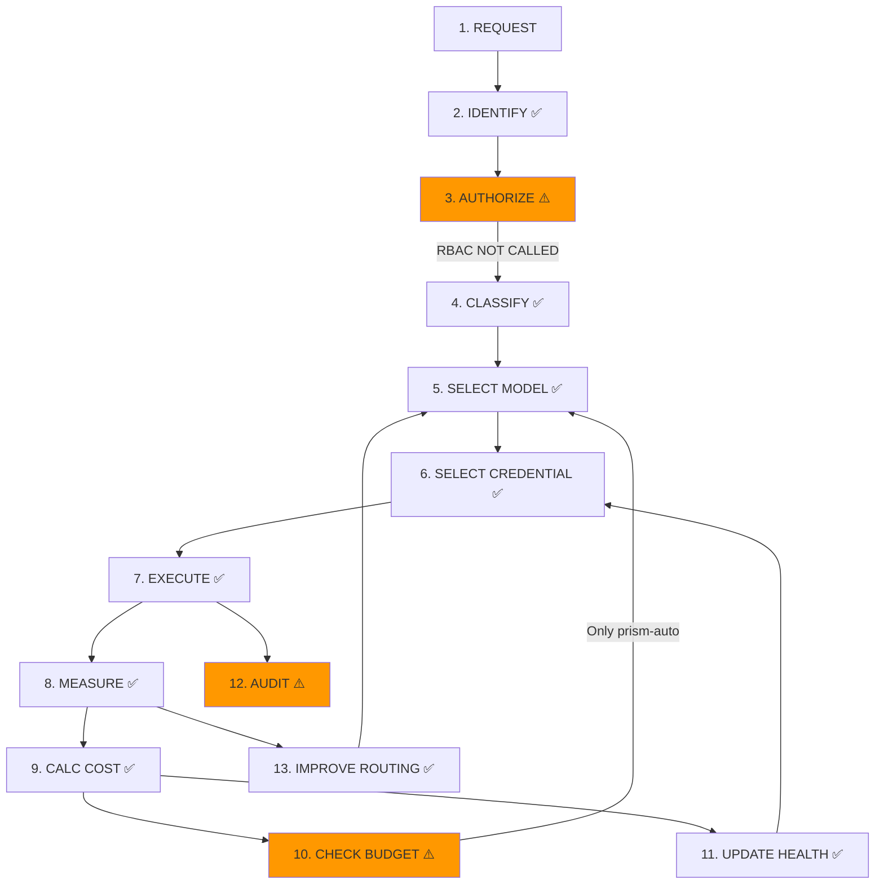
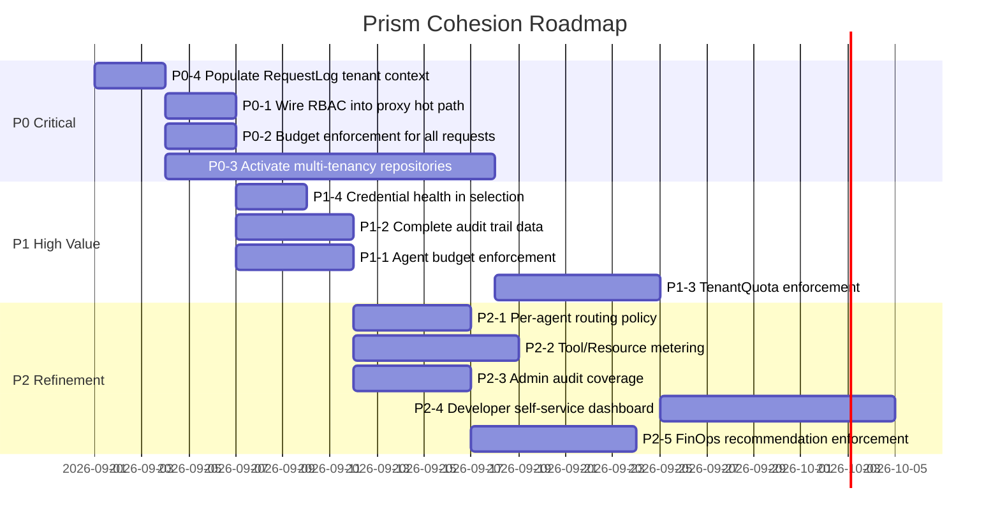

# Prism — Cohesive Architecture & Product Review

---

## Executive Summary

Prism has assembled an impressive range of AI infrastructure capabilities: provider-agnostic proxying, smart routing, credential management with health awareness, budget controls, RBAC governance, cryptographic audit trails, tool/resource/MCP gateways, multi-tenant schema, agent identity management, and real-time observability via SSE.

**The core finding**: These capabilities operate as **individually strong, collectively disconnected modules**. The proxy engine — which is the strongest system — has genuine closed loops (credential health → routing → failover → health update). But moving outward from the engine, capabilities become increasingly isolated: budgets influence routing only for `prism-auto`, agents lack budget enforcement, multi-tenancy is schema-only, RBAC doesn't gate the proxy hot path, and quotas are never enforced.

**Product Cohesion Score: 6.2 / 10**

The engine core scores ~8/10 (credential health, routing, failover, telemetry form a genuine feedback loop). The platform layer scores ~4/10 (multi-tenancy, RBAC, quotas, billing are structurally present but not wired into the execution path).

**What Prism Becomes When Connected**: An organizational AI control plane where every request flows through Identity → Authorization → Classification → Selection → Execution → Measurement → Governance — and the outputs of every stage feed back into improving future decisions.

---

## 1. Product Cohesion — Domain Relationship Matrix

| Capability | Inputs | Outputs | Depends On | Used By | Cohesion | Priority |
|---|---|---|---|---|---|---|
| **Organization** | Admin creation | Tenant boundary, plan tier | — | Workspaces, Members, Quotas | ⚠️ Schema-only | P0 |
| **Workspace** | Org context | Scope for providers, tools | Organization | Providers, Agents, Tools | ⚠️ Schema-only | P0 |
| **Project** | Workspace context | Scope for keys, agents | Workspace | GatewayKeys, Agents | ⚠️ Schema-only | P1 |
| **User** | Auth login | `user_id` boundary | Session | All repositories | ✅ Strong | — |
| **Agent** | Admin CRUD | Identity + allowed models/tools/resources | User | GovernanceEngine, AuditTrail | ⚠️ Partial — no budget link | P1 |
| **Provider** | Admin CRUD | base_url, type, routing_strategy | User, Org | Models, Credentials, Router | ✅ Strong | — |
| **Model** | DB seed + Admin | capability scores, pricing | Provider | Scorer, Router, Cost calc | ✅ Strong | — |
| **Credential** | Admin + encryption | encrypted key, health, cooldown | Provider | Router, Engine retry loop | ✅ Strong | — |
| **Credential Health** | Request outcomes | health_score, status | Engine responses, Redis | Credential selection, UI | ✅ Strong | — |
| **Routing (Direct)** | Model slug, GatewayKey | Route (Model+Provider+Credential) | Models, Providers, Credentials, Cooldown | Engine | ✅ Strong | — |
| **Routing (Smart)** | `prism-auto`, messages | Scored candidates, RoutingDecision | Classifier, Scorer, Policy, Budget, Telemetry, Health | Engine, Dashboard | ✅ Strong | — |
| **RBAC** | GovernancePolicy rules | allow/deny evaluation | GovernancePolicy repo | ❌ **Not in proxy hot path** | ❌ Missing | P0 |
| **GovernancePolicy** | Admin CRUD | role×agent×model×tool patterns | User | RBAC evaluator (admin UI only) | ⚠️ Partial | P0 |
| **Tools** | Admin CRUD | tool definitions + backends | User | ToolGateway, Agent allowed_tools | ⚠️ Partial — no audit link | P2 |
| **Resources** | Admin CRUD | resource definitions + backends | User | ResourceGateway, Agent allowed_resources | ⚠️ Partial | P2 |
| **MCP** | Admin + sync | MCP server + tools list | User | MCPGateway | ⚠️ Isolated — no governance | P2 |
| **Metering (RequestLog)** | Every proxy call | tokens, cost, latency, model, provider, credential | Engine, GatewayHandler | Dashboard, FinOps, Budget, Audit, Health | ✅ Strong | — |
| **Usage (Dashboard)** | Aggregated request_logs | stats, usage charts, health | RequestLogRepo | Dashboard UI | ✅ Strong | — |
| **Budget** | Admin CRUD | monthly/daily limits, thresholds | User | Scorer (via budgetStatus), BudgetAlertWorker | ⚠️ Partial — advisory only for non-`prism-auto` | P0 |
| **TenantQuota** | Admin CRUD | per-org/ws/agent limits | Organization | ❌ **Not enforced anywhere** | ❌ Missing | P1 |
| **FinOps** | RequestLog aggregation | spend velocity, projections, recommendations | RequestLogRepo, BudgetRepo | Dashboard UI | ⚠️ Partial — read-only | P2 |
| **Audit (AIAuditTrail)** | Post-execution recording | Signed audit record | GatewayHandler | AuditTrail UI, verification | ⚠️ Partial — empty failover/tool arrays | P1 |
| **Audit (AdminAuditLog)** | Admin actions | action + actor log | AuditTrailRepo | AuditLog UI | ⚠️ Partial — not all handlers log | P2 |
| **Circuit Breaker** | 5xx errors | Quarantine state | CooldownStore (Redis) | Credential selection | ✅ Strong | — |

---

## 2. Orphan Features

### 2.1 Multi-Tenant Hierarchy (Organization → Workspace → Project)

**Why it feels disconnected**: The schema exists across 67 migrations. Foreign keys are set. Default tenant is seeded. But **no repository query filters by `org_id` or `workspace_id`**. The `TenantMiddleware` is defined in [`middleware/tenant.go`](file:///c:/me/projects/ai-gateway/apps/api/internal/middleware/tenant.go) but **never registered** in `main.go`. All queries use `WHERE user_id = ?`.

**Should connect to**: Every scoped entity (providers, credentials, models, agents, tools, resources, MCP, governance, gateway keys, budgets, request logs).

**Should produce**: Tenant-isolated data views, per-org usage aggregation, workspace-scoped budgets.

**Should be consumed by**: RBAC enforcement, budget hierarchy, usage dashboards, cost allocation.

### 2.2 Tenant Quotas

**Why it feels disconnected**: `TenantQuota` model exists with fields for `monthly_spend_limit_usd`, `daily_spend_limit_usd`, `daily_request_limit`, `max_concurrent_streams`. A full [`repository/quota.go`](file:///c:/me/projects/ai-gateway/apps/api/internal/repository/quota.go) and [`handlers/quota.go`](file:///c:/me/projects/ai-gateway/apps/api/internal/handlers/quota.go) exist. But no middleware or proxy code checks quotas before executing requests.

**Should connect to**: Proxy middleware (request gating), budget system (spend limits), rate limiting (request limits), streaming concurrency limiter.

### 2.3 RBAC Engine (Governance Policies)

**Why it feels disconnected**: [`RBACEngine.Evaluate()`](file:///c:/me/projects/ai-gateway/apps/api/internal/proxy/rbac_engine.go) is fully implemented with pattern matching, priority ordering, and deny-takes-precedence logic. But it's only called from [`handlers/governance_policy.go`](file:///c:/me/projects/ai-gateway/apps/api/internal/handlers/governance_policy.go) for admin-side "what if" evaluation. **The gateway proxy path never calls `RBACEngine.Evaluate()`.**

**Should connect to**: Gateway middleware → called before every proxy request to enforce model/tool/resource access policies.

### 2.4 Billing System

**Why it feels disconnected**: `subscription_plans`, `plan_features`, `organization_subscriptions`, `billing_invoices`, `daily_usage_aggregates` tables all exist. [`handlers/billing.go`](file:///c:/me/projects/ai-gateway/apps/api/internal/handlers/billing.go) has endpoints. But the handler returns seeded static data. No payment processor. No subscription enforcement (no "you've exceeded your plan's token limit" check).

**Should connect to**: Quota enforcement, plan-based feature gating, invoice generation from usage aggregation.

### 2.5 MCP Gateway

**Why it feels disconnected**: MCP servers, tools, and registry are full CRUD with sync and test capabilities. But MCP server calls are **not recorded in audit trails** (the `MCPServersCalled` field in `AIAuditTrail` is always `[]string{}`). MCP tools are not subject to governance policies. Agent `allowed_resources` doesn't cover MCP.

**Should connect to**: Audit trail (which MCP servers were called), governance (which agents can use which MCP servers), usage tracking.

---

## 3. Missing Relationships (Ranked)

### 3.1 RBAC → Proxy Hot Path

| Dimension | Assessment |
|-----------|-----------|
| **Business Impact** | 🔴 Critical — Without this, governance policies are advisory-only |
| **Technical Importance** | 🔴 High — The entire RBAC system is unused in production |
| **User Impact** | 🔴 High — Admins create policies that have no enforcement effect |
| **Implementation Complexity** | 🟢 Low — Engine already has `agentGovernance.ValidateAgentModelAccess()` in the hot path; RBAC evaluation is a similar check |
| **Security Impact** | 🔴 Critical — Model/tool/resource access is currently unrestricted |

**Evidence**: [`gateway.go:ChatCompletions()`](file:///c:/me/projects/ai-gateway/apps/api/internal/handlers/gateway.go#L76-L176) calls `engine.Proxy()` without ever calling `rbacEngine.Evaluate()`. The `rbacEngine` field exists on `GatewayHandler` (line 29) but is never used in the proxy path.

### 3.2 Budget → Request Rejection (Direct Model Requests)

| Dimension | Assessment |
|-----------|-----------|
| **Business Impact** | 🔴 Critical — Budget exceeded = no enforcement for non-prism-auto requests |
| **Technical Importance** | 🔴 High — Budget only influences routing for `prism-auto` model |
| **User Impact** | 🟡 Medium — Most users likely use `prism-auto`, but direct model requests bypass budget |
| **Implementation Complexity** | 🟢 Low — BudgetManager.GetStatus() already exists; add check before engine.Proxy() |
| **Security Impact** | 🟡 Medium — Financial risk when hard limits can be bypassed |

**Evidence**: In [`engine.go:resolveRoutes()`](file:///c:/me/projects/ai-gateway/apps/api/internal/proxy/engine.go#L134-L223), budget status is only checked inside the `if req.Model == "prism-auto"` branch (line 206). Direct model requests at line 222 call `ResolveWithFallback()` which has no budget awareness.

### 3.3 Multi-Tenancy → Repository Queries

| Dimension | Assessment |
|-----------|-----------|
| **Business Impact** | 🔴 Critical — Cannot serve multiple organizations |
| **Technical Importance** | 🔴 High — All data is globally visible to any authenticated user |
| **User Impact** | 🔴 High — Data isolation is a prerequisite for organizational use |
| **Implementation Complexity** | 🟡 Medium — Requires updating ~35 repository files to add tenant context filtering |
| **Security Impact** | 🔴 Critical — Cross-tenant data access |

**Evidence**: Every repository method uses `WHERE user_id = $1`. For example, [`repository/credential.go:FindAllActiveByProviderID`](file:///c:/me/projects/ai-gateway/apps/api/internal/repository/credential.go) queries by `provider_id` without any org/workspace filter.

### 3.4 TenantQuota → Proxy Enforcement

| Dimension | Assessment |
|-----------|-----------|
| **Business Impact** | 🟡 Medium — Organizations can't set per-workspace or per-agent spend limits |
| **Technical Importance** | 🟡 Medium — Schema and repository exist; enforcement is the gap |
| **User Impact** | 🟡 Medium — Cost containment per team/agent |
| **Implementation Complexity** | 🟡 Medium — Need middleware that checks quotas against request_logs spend |
| **Security Impact** | 🟡 Medium — Unbounded spend per agent/workspace |

### 3.5 Audit Trail → Actual Failover Chain

| Dimension | Assessment |
|-----------|-----------|
| **Business Impact** | 🟡 Medium — Compliance requires knowing which credentials were tried |
| **Technical Importance** | 🟡 Medium — Data exists in `request_logs.attempts` but not propagated to audit |
| **Implementation Complexity** | 🟢 Low — Engine already stores `attempts` in request log; pass to audit recorder |

**Evidence**: In [`gateway.go:recordAuditTrail()`](file:///c:/me/projects/ai-gateway/apps/api/internal/handlers/gateway.go#L398-L447), `FailoverChain` is hardcoded to `[]string{}` (line 422). The actual failover data is in `log.Attempts` (a JSON column already populated by the engine).

### 3.6 Agent → Budget Enforcement

| Dimension | Assessment |
|-----------|-----------|
| **Business Impact** | 🟡 Medium — Agents have `max_budget_cents` field but it's never enforced |
| **Technical Importance** | 🟡 Medium — Field exists on Agent model, no code checks it |
| **Implementation Complexity** | 🟡 Medium — Need to sum agent's request_log costs and compare |

**Evidence**: `Agent.MaxBudgetCents` is stored in the database and displayed in the UI. `AgentGovernanceEngine` validates model/tool access but **never checks budget**.

---

## 4. The Prism Control Loop

### Current Implementation Analysis

| # | Stage | Exists? | Location | Produces | Next Stage Consumes? | Persisted? | Feeds Future Decisions? |
|---|-------|---------|----------|----------|---------------------|-----------|----------------------|
| 1 | **REQUEST** | ✅ | `POST /v1/chat/completions` | HTTP request body | ✅ | — | — |
| 2 | **IDENTIFY** | ✅ | `GatewayAuthMiddleware` | `gatewayKey` in context | ✅ | — | — |
| 3 | **AUTHORIZE** | ⚠️ **Partial** | `AgentPolicyMiddleware` checks agent exists; `AllowedModels` enforced in Router | Agent identity | ⚠️ RBAC not called | — | — |
| 4 | **UNDERSTAND WORKLOAD** | ✅ (`prism-auto` only) | `classifier.go:ClassifyRequest()` | TaskType, Complexity, ContextTokens | ✅ → Scorer | ✅ (RoutingDecision) | ✅ |
| 5 | **SELECT MODEL** | ✅ (`prism-auto`) / N/A (direct) | `scorer.go:ScoreCandidatesWithBudgetAndTelemetry()` | Ranked ModelScore[] | ✅ → Router | ✅ (RoutingDecision) | ✅ (telemetry feedback) |
| 6 | **SELECT CREDENTIAL** | ✅ | `router.go:ResolveWithFallback()` | Route[] (ordered by strategy) | ✅ → Engine | — | ✅ (cooldown state feeds selection) |
| 7 | **EXECUTE** | ✅ | `engine.go:Proxy()/ProxyStream()` | HTTP response, tokens, latency | ✅ | — | — |
| 8 | **MEASURE** | ✅ | Engine lines 501-527, 529-534 | Usage{}, latency, TTFT | ✅ | ✅ (Redis telemetry) | ✅ (latency feeds scorer) |
| 9 | **CALCULATE COST** | ✅ | Engine lines 542-544 | `costUSD` | ✅ | ✅ (request_logs) | ✅ (FinOps, budget) |
| 10 | **CHECK BUDGET** | ⚠️ **Pre-request only, smart router only** | `engine.go` line 206-210 | budgetStatus string | ✅ → Scorer | ✅ (10s cache) | ✅ |
| 11 | **UPDATE HEALTH** | ✅ | `engine.go:syncCredentialHealth()` (async) | health_score, status | ✅ → Credential selection | ✅ (PostgreSQL) | ✅ |
| 12 | **AUDIT** | ⚠️ **Partial** | `gateway.go:recordAuditTrail()` | AIAuditTrail with signature | — (terminal) | ✅ | ❌ (no feedback loop) |
| 13 | **IMPROVE FUTURE ROUTING** | ✅ | Telemetry → Scorer, HealthStore → Scorer | Updated model scores | ✅ → Stage 5 | ✅ (Redis + hourly DB flush) | ✅ |

### Where the Control Loop is Broken



**Break 1 — Authorization**: RBAC policies exist but are not evaluated. The `Evaluate()` function is never called in the proxy path.

**Break 2 — Budget for direct requests**: Budget check only runs for `prism-auto`. A request for `gpt-4o` with exceeded budget will still execute.

**Break 3 — Audit completeness**: Failover chain, tools invoked, resources accessed, MCP servers called are all hardcoded to empty arrays.

**Break 4 — Post-request budget check**: Cost is calculated AFTER execution. There is no pre-request budget gate that would reject a request BEFORE consuming tokens.

---

## 5. AI Resource Model

Prism treats the following as resources, but **without a unified abstraction**:

| Resource | How It's Managed | How It's Accessed | Governed? | Metered? |
|----------|-----------------|-------------------|-----------|----------|
| **Model** | DB table, Admin CRUD | Router → Adapter | ✅ AllowedModels on Agent/GatewayKey | ✅ RequestLog |
| **Provider** | DB table, Admin CRUD | Router resolves from Model | ✅ Enabled flag | ⚠️ Implicitly via RequestLog |
| **Credential** | DB table, encrypted | Engine decrypts at runtime | ❌ No access control per credential | ✅ request_count, health |
| **Tool** | DB table, Admin CRUD | ToolGateway HTTP call | ✅ Agent.AllowedTools | ❌ No metering |
| **Resource** | DB table, Admin CRUD | ResourceGateway HTTP/SQL call | ✅ Agent.AllowedResources | ❌ No metering |
| **MCP Server** | DB table, Admin CRUD | MCPGateway JSON-RPC | ❌ Not governed | ❌ No metering |
| **Agent** | DB table, Admin CRUD | X-Prism-Agent-ID header | ✅ GovernancePolicy | ❌ No per-agent cost tracking |

**Conceptual inconsistency**: Models, Tools, Resources, and MCP Servers are all "AI capabilities" that agents consume. But they have completely different governance, metering, and access control mechanisms. There is no common `AIResource` abstraction.

---

## 6. AI Consumption Model

### Can Prism answer: *"Who consumed what, through which resource, using which model, at what cost, under which policy?"*

| Dimension | Tracked? | Where | Connected? |
|-----------|---------|-------|-----------|
| **Request** | ✅ | `request_logs` | Primary unit |
| **Token** | ✅ | `request_logs.input_tokens`, `output_tokens` | ✅ → cost |
| **Model** | ✅ | `request_logs.model` | ✅ → routing decisions |
| **Credential** | ✅ | `request_logs.credential_id` | ✅ → health |
| **User** | ⚠️ Partial | Via `gateway_api_key_id` → `user_id` | ⚠️ Indirect |
| **Agent** | ⚠️ Partial | `ai_audit_trails.agent_id` only | ❌ Not in request_logs |
| **Project** | ⚠️ Schema-only | `request_logs.project_id` column exists | ❌ Never populated at runtime |
| **Workspace** | ⚠️ Schema-only | `request_logs.workspace_id` column exists | ❌ Never populated at runtime |
| **Organization** | ⚠️ Schema-only | `request_logs.org_id` column exists | ❌ Never populated at runtime |
| **Provider** | ✅ | `request_logs.provider_id`, `provider_type` | ✅ |
| **Policy** | ⚠️ Smart router only | `routing_decisions.policy_name` | ⚠️ Only for prism-auto requests |

**Verdict**: Prism can reliably answer "which model at what cost" per-request. It **cannot** reliably answer "which team", "which project", or "which agent spent how much" because the tenant context columns are never populated and agent_id is only in the audit trail, not in request_logs.

---

## 7. Governance Model

### Current State

```
Organization (schema, not enforced)
└── Workspace (schema, not enforced)
    └── Project (schema, not enforced)
        └── User (actual boundary via user_id)
            ├── GatewayKey.AllowedModels ✅ ENFORCED
            ├── Agent.AllowedModels ✅ ENFORCED (via AgentGovernanceEngine)
            ├── Agent.AllowedTools ✅ ENFORCED (via AgentGovernanceEngine)
            ├── GovernancePolicy ❌ NOT ENFORCED in proxy
            ├── Budget ⚠️ PARTIALLY ENFORCED (prism-auto only)
            └── TenantQuota ❌ NOT ENFORCED
```

### What's Missing

1. **Governance hierarchy** doesn't cascade. An org-level policy cannot constrain workspace-level usage.
2. **Budget hierarchy** doesn't exist. There's one flat `budgets` table per user. No org→workspace→project→agent budget inheritance.
3. **RBAC is disconnected** from the execution path. It's a "simulation" tool only.
4. **Credential access control** doesn't exist. Any gateway key can use any credential of the same provider.

---

## 8. Model Intelligence Assessment

### What Exists (Strong Foundation)

| Component | Status | Evidence |
|-----------|--------|---------|
| **Task Classification** | ✅ Implemented | [`classifier.go`](file:///c:/me/projects/ai-gateway/apps/api/internal/proxy/classifier.go) — 7 task types: coding, reasoning, writing, translation, summarization, extraction, general |
| **Complexity Detection** | ✅ Implemented | Low/Medium/High based on message count, char count, code blocks |
| **Model Capability Scores** | ✅ Implemented | `coding_score`, `reasoning_score`, `writing_score`, `speed_score`, `quality_score` per model |
| **Multi-Criteria Scoring** | ✅ Implemented | Weighted sum: task_match × W1 + quality × W2 + cost × W3 + speed × W4 |
| **Policy-Based Weights** | ✅ Implemented | User-configurable routing policies (e.g., "cost-optimized" vs "quality-first") |
| **Budget-Aware Downgrade** | ✅ Implemented | warning → 0.8x penalty on expensive models; critical → filter expensive; exceeded → cheapest only |
| **Health-Aware Scoring** | ✅ Implemented | Provider health score (0-1) multiplied into final score |
| **Telemetry Feedback** | ✅ Implemented | Real P95 TTFT latency from Redis adjusts speed score at runtime |
| **Routing Simulation** | ✅ Implemented | `/routing/simulate` endpoint for what-if testing |

### What's Missing

| Gap | Impact |
|-----|--------|
| Vision/multimodal task detection | Classifier only analyzes text content; doesn't detect image-based tasks |
| Embedding task detection | No embedding-specific routing |
| Per-agent routing policy | Agents can't have their own routing preferences |
| Cost feedback into classifier accuracy | No tracking of whether the classifier chose the right task type |

**Assessment**: Model intelligence is **the strongest system in Prism**. The classify → score → route → measure → feedback loop is genuinely closed for `prism-auto` requests.

---

## 9. Budget as a Control Mechanism

### Current State

| Budget Capability | Status | Evidence |
|-------------------|--------|---------|
| **Budget definition** | ✅ | CRUD at `/budgets` |
| **Spend tracking** | ✅ | `BudgetManager.getSpendCached()` aggregates from request_logs |
| **Status computation** | ✅ | healthy/warning/critical/exceeded based on thresholds |
| **Influence on smart routing** | ✅ | Budget status passed to scorer for model downgrade |
| **Pre-request rejection** | ❌ | No request is ever rejected due to budget |
| **Hard limit enforcement** | ❌ | `hard_limit` field exists but is never checked |
| **Per-workspace budget** | ❌ | Budget is flat per user_id |
| **Per-agent budget** | ❌ | Agent.MaxBudgetCents is stored but never checked |
| **Post-request budget check** | ❌ | No "you just exceeded your budget" alert per-request |
| **Budget alerts** | ✅ | BudgetAlertScanner worker publishes SSE events |

**Verdict**: Budget is a **reporting and advisory system**, not a control mechanism. It influences smart routing decisions but cannot prevent a request from executing.

---

## 10. Credential Intelligence

### Can Prism intelligently select credentials? **Yes, partially.**

| Criterion | Implemented? | How |
|-----------|-------------|-----|
| **Provider association** | ✅ | `credential.provider_id` |
| **Priority ordering** | ✅ | `credential.priority` field, used in `fallback_cascade` |
| **Cooldown awareness** | ✅ | Redis TTL key prevents selecting cooled-down credentials |
| **Round-robin distribution** | ✅ | `FindRoundRobin` uses `last_used_at` ordering |
| **LRU strategy** | ✅ | `FindLRU` selects least-recently-used |
| **Circuit breaker** | ✅ | 3 errors in 5 min → quarantine |
| **Health score** | ✅ | Computed from success rate, cooldown, quota |
| **Quota tracking** | ✅ | `extractAndSaveQuota()` parses rate limit headers |
| **Status machine** | ✅ | healthy → degraded → cooldown → exhausted → disabled |

### What's Missing

| Gap | Impact |
|-----|--------|
| **Health score not used in credential selection** | Credential selection is by strategy (round-robin/LRU/priority), not by health score |
| **No per-credential cost tracking** | Can't determine which credentials are cheapest to use |
| **No credential → agent access control** | Any agent using any gateway key can consume any credential |
| **Health score not in provider health** | `ProviderHealthStore` computes from request_logs, not from credential health scores |

---

## 11. Developer Experience Assessment

| Step | Current Experience | Friction |
|------|-------------------|---------|
| **Get access** | Admin creates gateway key in dashboard | Developer can't self-serve |
| **Authenticate** | `Bearer gw_sk_*` in Authorization header | ✅ Simple |
| **Choose context** | Optional `X-Prism-Agent-ID`, `X-Prism-Org-ID` headers | Unclear which headers are needed |
| **Send request** | OpenAI-compatible `POST /v1/chat/completions` | ✅ Excellent — drop-in replacement |
| **Model selection** | Use `prism-auto` or specify model directly | ✅ Good |
| **Failover** | Automatic and invisible to client | ✅ Excellent |
| **Understand usage** | No per-developer dashboard; admin sees everything | ❌ Developer blindspot |
| **Understand cost** | No per-key cost visibility | ❌ Developer blindspot |
| **Know why model was selected** | `X-Prism-Model` / `X-Prism-Provider` response headers | ⚠️ Limited — no routing explanation in response |

**Assessment**: The API experience is excellent (OpenAI-compatible). The observability experience is admin-only. Developers have no self-service visibility.

---

## 12. Administrator Experience Assessment

| Admin Question | Answerable? | How |
|----------------|------------|-----|
| Who is using AI? | ⚠️ Partial | By gateway key usage, not by user/team |
| What models do they use? | ✅ | request_logs.model column |
| Which providers are used? | ✅ | request_logs.provider_type |
| Which credentials are consumed? | ✅ | request_logs.credential_id |
| How much is being spent? | ✅ | Dashboard stats, FinOps |
| Which teams consume the most? | ❌ | No team/workspace attribution |
| Which models are expensive? | ✅ | Model pricing + FinOps analytics |
| Which credentials are unhealthy? | ✅ | Credential health UI |
| Which agents consume budget? | ❌ | No per-agent cost aggregation |
| Which policies are being violated? | ❌ | RBAC is not enforced, no violation tracking |
| Why requests are routed to certain models? | ✅ (prism-auto) | Routing decisions with score breakdowns |

**Assessment**: Admin experience is strong for infrastructure monitoring but weak for organizational governance.

---

## 13. Architecture Robustness

### Concrete Risks (with code evidence)

| Risk | Evidence | Severity |
|------|----------|----------|
| **1. Budget race condition** | `BudgetManager` uses `sync.Map` with 10-second TTL cache ([`budget_manager.go:91-109`](file:///c:/me/projects/ai-gateway/apps/api/internal/proxy/budget_manager.go#L91-L109)). Multiple concurrent requests can each see "under budget" and all execute. No atomic check-and-debit. | 🟡 Medium |
| **2. No distributed rate limiting** | `ProviderThrottler` and `ProviderConcurrencyLimiter` are in-memory ([`throttler.go`](file:///c:/me/projects/ai-gateway/apps/api/internal/proxy/throttler.go), [`concurrency.go`](file:///c:/me/projects/ai-gateway/apps/api/internal/proxy/concurrency.go)). Multiple API instances would each maintain independent limits. | 🟡 Medium |
| **3. Gateway key cache staleness** | `GatewayKeyCache` is in-memory with no TTL or invalidation strategy visible. A revoked key could remain cached. | 🟡 Medium |
| **4. Retry storm potential** | Engine retries across all credentials with `calculateBackoff(i)`. If 10 credentials are all returning 429, the client blocks for the cumulative backoff of all 10 attempts. | 🟡 Medium |
| **5. Fire-and-forget goroutines** | Multiple `go func()` calls with `defer recover()` for payload persistence, tool invocation logging, credential health sync. Failures are silently swallowed. | 🟡 Medium |
| **6. No tenant isolation in queries** | All repositories query by `user_id` only. If two users share credentials via organization, there's no boundary. | 🔴 High (if multi-tenant) |
| **7. Credential decryption fallback** | [`engine.go:358-363`](file:///c:/me/projects/ai-gateway/apps/api/internal/proxy/engine.go#L358-L363): If AES decryption fails but `EncryptedKey != ""`, the engine uses the raw encrypted key as the API key. This is a silent fallback that could send garbage to the provider. | 🟡 Medium |
| **8. Provider health store mutex** | [`health_store.go:60-74`](file:///c:/me/projects/ai-gateway/apps/api/internal/proxy/health_store.go#L60-L74): Lock is held during DB query (`s.fetch(ctx)`). Under load, all routing goroutines block waiting for one health score refresh. | 🟡 Medium |

---

## 14. UX Cohesion Assessment

### Current Mental Model

The dashboard presents **20 sidebar items** across 5 groups. Each page is a **standalone CRUD interface** for its domain entity. There are no cross-entity navigation paths.

| From Page | Can Navigate To | Missing Connection |
|-----------|----------------|-------------------|
| Credential | Provider (parent) | ❌ Can't see which models use this credential, or which agents, or historical cost through this credential |
| Model | Provider (parent) | ❌ Can't see which credentials back this model, or usage/cost through this model |
| Agent | — | ❌ Can't see agent's accumulated cost, which models it actually used, or which credentials served its requests |
| Budget | — | ❌ Can't see which requests consumed budget, or which agents/models contribute most to spend |
| Gateway Key | — | ❌ Can't see key's accumulated cost, or which models/agents used it |

**Verdict**: The UI is a **entity management console**, not a **platform control plane**. Each page answers "what exists?" but not "how does it relate to everything else?"

---

## 15. Information Architecture

### Mapping Existing Features to Concepts

| Concept | Prism Features | Status |
|---------|---------------|--------|
| **Identity** — Who is using Prism? | Users, GatewayKeys, Agents, Org/Workspace/Project | ⚠️ Fragmented — User is auth-only, Agent is governance-only, GatewayKey is the actual consumption identity |
| **Resources** — What AI resources are available? | Providers, Models, Credentials, Tools, Resources, MCP | ✅ Well-cataloged, no unified abstraction |
| **Policies** — What are users allowed to do? | GovernancePolicy, Agent.AllowedModels/Tools, GatewayKey.AllowedModels | ⚠️ Duplicated — three separate permission systems |
| **Intelligence** — How does Prism decide? | Classifier, Scorer, RoutingPolicy, HealthStore | ✅ Strong |
| **Execution** — How does the request run? | Engine, Router, Adapters, Throttler, Concurrency | ✅ Strong |
| **Consumption** — What was consumed? | RequestLog, RequestPayload, ToolInvocation | ⚠️ Missing: per-agent, per-workspace aggregation |
| **Governance** — Was it allowed? | RBACEngine (unused), AgentGovernance (used) | ⚠️ Disconnected from execution |
| **Economics** — How much did it cost? | Cost calc, Budget, FinOps, Anomaly Detection | ⚠️ Reporting only, not controlling |
| **Reliability** — Was the resource healthy? | CredentialHealth, ProviderHealth, CircuitBreaker, Cooldown | ✅ Strong |
| **Observability** — What happened? | Dashboard, Logs, SSE, AuditTrail, RoutingDecisions | ✅ Strong |

---

## 16. The Golden Path — Gap Analysis

| Golden Path Step | Exists? | Gap |
|-----------------|---------|-----|
| 1. Create Organization | ✅ Schema | ❌ No admin UI for org creation |
| 2. Create Workspace | ✅ Schema | ❌ No admin UI for workspace creation |
| 3. Connect Providers | ✅ Full | — |
| 4. Add Credentials | ✅ Full | — |
| 5. Credentials become health-aware | ✅ Full | — |
| 6. Configure Models | ✅ Full (seed + CRUD) | — |
| 7. Define Agent | ✅ Full | — |
| 8. Assign Routing Policy | ✅ Full | ⚠️ Not per-agent |
| 9. Assign Budget | ✅ Full | ⚠️ Not per-agent, not enforceable |
| 10. Developer uses Prism API | ✅ Full | — |
| 11. Prism authenticates user | ✅ GatewayKey auth | — |
| 12. **Policy evaluated** | ❌ **MISSING** | RBAC not called in proxy path |
| 13. Workload classified | ✅ (`prism-auto`) | ❌ Not for direct model requests |
| 14. Model selected | ✅ Full | — |
| 15. Healthy credential selected | ✅ Full | ⚠️ Health score not directly used in selection |
| 16. Request executed | ✅ Full | — |
| 17. Usage recorded | ✅ Full | ⚠️ Missing org/workspace/project/agent columns |
| 18. Cost calculated | ✅ Full | — |
| 19. **Budget updated** | ⚠️ Partial | Budget checks cached spend, doesn't atomically update |
| 20. Audit recorded | ⚠️ Partial | Missing failover chain, tools, resources |
| 21. **Health updated** | ✅ Full | — |

**Critical gaps**: Steps 12 (policy enforcement), 17 (tenant attribution), 19 (budget as control), and 20 (complete audit).

---

## 17. Prioritized Recommendations

### P0 — Critical (Must fix for platform model)

#### P0-1: Wire RBAC into Proxy Hot Path

| Aspect | Detail |
|--------|--------|
| **Problem** | `RBACEngine.Evaluate()` is never called during proxy request processing |
| **Current** | RBAC only available as admin "what-if" simulation at `/governance/evaluate` |
| **Why it matters** | Governance policies have zero enforcement effect; admins create policies that don't do anything |
| **Related domains** | GovernancePolicy, Agent, Model, Tool, GatewayKey |
| **Proposed change** | In `GatewayHandler.ChatCompletions()`, after agent resolution, call `rbacEngine.Evaluate()` with the agent's role, model, and agent name. Deny request if result is `Allowed: false` |
| **Expected outcome** | Governance policies actually enforce model/tool/resource access |
| **Complexity** | 🟢 Low — ~30 lines of code in `gateway.go` |
| **Risk** | 🟢 Low — Default-allow means existing users unaffected unless they've created deny policies |

#### P0-2: Budget Enforcement for All Requests

| Aspect | Detail |
|--------|--------|
| **Problem** | Budget only influences routing for `prism-auto`. Direct model requests bypass budget entirely. `hard_limit` flag is stored but never checked. |
| **Current** | `BudgetManager.GetStatus()` called only inside `if req.Model == "prism-auto"` block |
| **Why it matters** | Financial control is the #1 organizational concern. A system that can't enforce spend limits is advisory software, not a control plane. |
| **Related domains** | Budget, Router, Engine, GatewayKey, Agent |
| **Proposed change** | In `GatewayHandler.ChatCompletions()`, before calling `engine.Proxy()`, check `BudgetManager.GetStatus()`. If `status == "exceeded" && budget.HardLimit`, return 429 with clear error. If `status == "critical"`, set header warning. For all requests (not just prism-auto), pass budgetStatus to influence credential/model selection. |
| **Expected outcome** | Budget becomes a control mechanism, not just a dashboard widget |
| **Complexity** | 🟢 Low — ~40 lines in gateway handler |
| **Risk** | 🟡 Medium — Could reject legitimate requests if budget thresholds are misconfigured |

#### P0-3: Activate Multi-Tenancy in Repositories

| Aspect | Detail |
|--------|--------|
| **Problem** | All repositories query by `user_id`. The `org_id`, `workspace_id`, `project_id` columns are never used in WHERE clauses. TenantMiddleware is never registered. |
| **Current** | Single-user system despite multi-tenant schema |
| **Why it matters** | This is the prerequisite for organizational use. Without it, Prism can't serve multiple teams. |
| **Related domains** | Every domain entity |
| **Proposed change** | 1) Register `TenantMiddleware` in `main.go`. 2) Add `TenantContext` parameter to critical repository methods (providers, credentials, models, agents, gateway keys, tools, resources). 3) Add `AND org_id = $N` to queries. 4) Populate `request_logs.org_id/workspace_id/project_id` from TenantContext during logging. |
| **Expected outcome** | Data isolation per organization/workspace |
| **Complexity** | 🟡 Medium — ~35 repository files need tenant-aware queries |
| **Risk** | 🟡 Medium — Must ensure backward compatibility with `org_default` for existing data |

#### P0-4: Populate Request Log Tenant Context

| Aspect | Detail |
|--------|--------|
| **Problem** | `request_logs.org_id`, `workspace_id`, `project_id` columns exist but are never populated at runtime |
| **Current** | Migration 060 backfilled existing rows to `org_default/ws_default/proj_default` but runtime code doesn't set them |
| **Why it matters** | Without this, no per-team/project cost attribution, no workspace budget checking, no organizational usage visibility |
| **Related domains** | RequestLog, Budget, FinOps, Dashboard, AuditTrail |
| **Proposed change** | In `GatewayHandler`, extract tenant context from gateway key's `org_id/workspace_id/project_id` (which already exist as columns) and populate the request log before persisting |
| **Expected outcome** | Usage, cost, and audit data is attributable to org/workspace/project |
| **Complexity** | 🟢 Low — ~10 lines in gateway handler |
| **Risk** | 🟢 Low — Additive change |

---

### P1 — High Value (Strongly improves cohesion)

#### P1-1: Agent Budget Enforcement

| Aspect | Detail |
|--------|--------|
| **Problem** | `Agent.MaxBudgetCents` field exists in the database and UI but is never checked |
| **Proposed change** | In `AgentGovernanceEngine`, after model/tool access check, query `SUM(cost_usd) FROM request_logs WHERE agent header matches` and compare against `max_budget_cents`. Deny if exceeded. |
| **Complexity** | 🟡 Medium |

#### P1-2: Complete Audit Trail Data

| Aspect | Detail |
|--------|--------|
| **Problem** | `failover_chain`, `tools_invoked`, `resources_accessed`, `mcp_servers_called` are all hardcoded to `[]string{}` |
| **Proposed change** | Pass `log.Attempts` (already JSON in request_log) to parse credential IDs for failover chain. For tool/resource/MCP, instrument the respective gateways to record invocations in context, then propagate to audit. |
| **Complexity** | 🟡 Medium |

#### P1-3: TenantQuota Enforcement

| Aspect | Detail |
|--------|--------|
| **Problem** | TenantQuota repository exists with full CRUD but no enforcement point |
| **Proposed change** | Create `QuotaMiddleware` that checks `daily_request_limit` and `monthly_spend_limit_usd` from `TenantQuota` table against accumulated usage. Apply as middleware on gateway routes. |
| **Complexity** | 🟡 Medium |

#### P1-4: Credential Health in Selection Strategy

| Aspect | Detail |
|--------|--------|
| **Problem** | Credential health score is computed and stored but not used in `selectByStrategy()`. Selection is purely round-robin/LRU/priority. |
| **Proposed change** | Add `health_weighted` strategy that uses health_score as a selection weight. Or: in existing strategies, skip credentials with `health_score < 50`. |
| **Complexity** | 🟢 Low |

---

### P2 — Refinement

#### P2-1: Per-Agent Routing Policy
Allow agents to reference a routing policy ID, so different agents can have different quality/cost/speed preferences.

#### P2-2: Tool/Resource/MCP Metering
Create `tool_execution_logs` and `resource_execution_logs` tables to track tool/resource usage, cost, and latency.

#### P2-3: Admin Action Audit Coverage
Ensure all handler CRUD operations (create/update/delete provider, credential, model, agent, policy, budget) record an admin audit log entry.

#### P2-4: Developer Self-Service Dashboard
Create a read-only view scoped to a gateway key showing its own usage, cost, and model distribution.

#### P2-5: FinOps Recommendation Enforcement
Connect FinOps cost recommendations to routing policy adjustments (e.g., "switch coding tasks from Claude to GPT-4o-mini" → auto-adjust policy weights).

---

## 18. The Most Important Question

### If Prism's current features were connected correctly, what would Prism become?

**Prism would become an Organizational AI Control Plane** — a system where every AI request from every developer, agent, and application flows through a unified pipeline that enforces identity, authorization, intelligence, execution, economics, and governance as a single coherent lifecycle.

### Target Architecture

```
┌─────────────────────────────────────────────────────────┐
│                   IDENTITY LAYER                         │
│  Organization → Workspace → Project → User/Agent        │
│  GatewayKey authentication + TenantContext resolution    │
└────────────────────────┬────────────────────────────────┘
                         ▼
┌─────────────────────────────────────────────────────────┐
│                 GOVERNANCE LAYER                         │
│  RBAC Policy evaluation (allow/deny per model/tool)     │
│  Agent governance (allowed_models, allowed_tools)       │
│  Budget gate (hard limit enforcement)                   │
│  Quota check (per-org/workspace/agent limits)           │
└────────────────────────┬────────────────────────────────┘
                         ▼
┌─────────────────────────────────────────────────────────┐
│               INTELLIGENCE LAYER                         │
│  Prompt classification (task type + complexity)          │
│  Model scoring (quality×cost×speed×health×budget)       │
│  Routing policy application                             │
│  Budget-aware model downgrade                           │
└────────────────────────┬────────────────────────────────┘
                         ▼
┌─────────────────────────────────────────────────────────┐
│               EXECUTION LAYER                            │
│  Credential selection (health-weighted, cooldown-aware)  │
│  Provider adapter translation                           │
│  Retry with exponential backoff across credential pool  │
│  Circuit breaker + quarantine                           │
│  Idempotency                                            │
└────────────────────────┬────────────────────────────────┘
                         ▼
┌─────────────────────────────────────────────────────────┐
│            MEASUREMENT LAYER                             │
│  Token counting + cost calculation                      │
│  Latency + TTFT recording                               │
│  Credential health score update                         │
│  Provider health aggregation                            │
│  Model telemetry (P50/P95 latency, success rate)        │
└────────────────────────┬────────────────────────────────┘
                         ▼
┌─────────────────────────────────────────────────────────┐
│          ECONOMICS & COMPLIANCE LAYER                    │
│  Budget consumption tracking                            │
│  Tenant quota enforcement                               │
│  Cost anomaly detection (z-score)                       │
│  Budget alerts                                          │
│  Cryptographic audit trail                              │
│  Admin action audit                                     │
└────────────────────────┬────────────────────────────────┘
                         ▼
┌─────────────────────────────────────────────────────────┐
│              FEEDBACK LAYER                              │
│  Telemetry → Model scorer (latency, success rate)       │
│  Credential health → Credential selection               │
│  Provider health → Model scoring                        │
│  Budget status → Model downgrade/rejection              │
│  Anomaly detection → Budget alerts                      │
│  FinOps → Cost optimization recommendations             │
└─────────────────────────────────────────────────────────┘
```

**The resulting system is not a list of features. It is a pipeline** where:

- The **Identity Layer** establishes *who* is making the request and *within what organizational boundary*.
- The **Governance Layer** determines *whether they're allowed* to make this request, with this model, with this budget.
- The **Intelligence Layer** determines *the best way* to execute this request given current conditions.
- The **Execution Layer** *actually does it*, with reliability guarantees.
- The **Measurement Layer** *observes what happened* and updates the system's knowledge.
- The **Economics Layer** *accounts for it* financially and ensures compliance.
- The **Feedback Layer** *improves future decisions* by feeding measured reality back into intelligence and governance.

Every request produces data that improves the next request. Every credential failure makes the next credential selection smarter. Every budget update makes the next routing decision more cost-aware. Every audit record builds a verifiable history.

**This is what already exists inside `proxy/engine.go` for the narrow case of `prism-auto` + credential failover.** The P0 recommendations simply extend this closed-loop to cover: all request types (not just prism-auto), all governance dimensions (not just agent model access), all tenant boundaries (not just user_id), and all economic controls (not just advisory budgets).

---

## 19. Recommended Implementation Sequence



**Start with P0-4** (populate tenant context on request logs) because it's the simplest change (~10 lines) and immediately enables P0-1, P0-2, and P0-3 to have meaningful data to work with.

**P0-1 and P0-2 can be done in parallel** — RBAC enforcement and budget enforcement are independent code paths in the gateway handler.

**P0-3 is the largest effort** and should run as a focused sprint. It touches the most files but is mechanically repetitive (add `org_id` filter to SQL queries).

The P1 and P2 items each build on the P0 foundation and can be prioritized based on organizational need.
